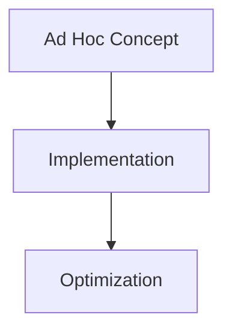

# Ad Hoc

This is a detailed page about Ad Hoc. Here is an illustrative diagram:

```mermaid
flowchart TD
  A[Ad Hoc Concept] --> B[Implementation]
  B --> C[Optimization]
```

[Back to README](../README.md)